Nama : Amarramitha Poodja Thantawi
NIM : H1D022064
Shift Baru : C

*Proses Register*
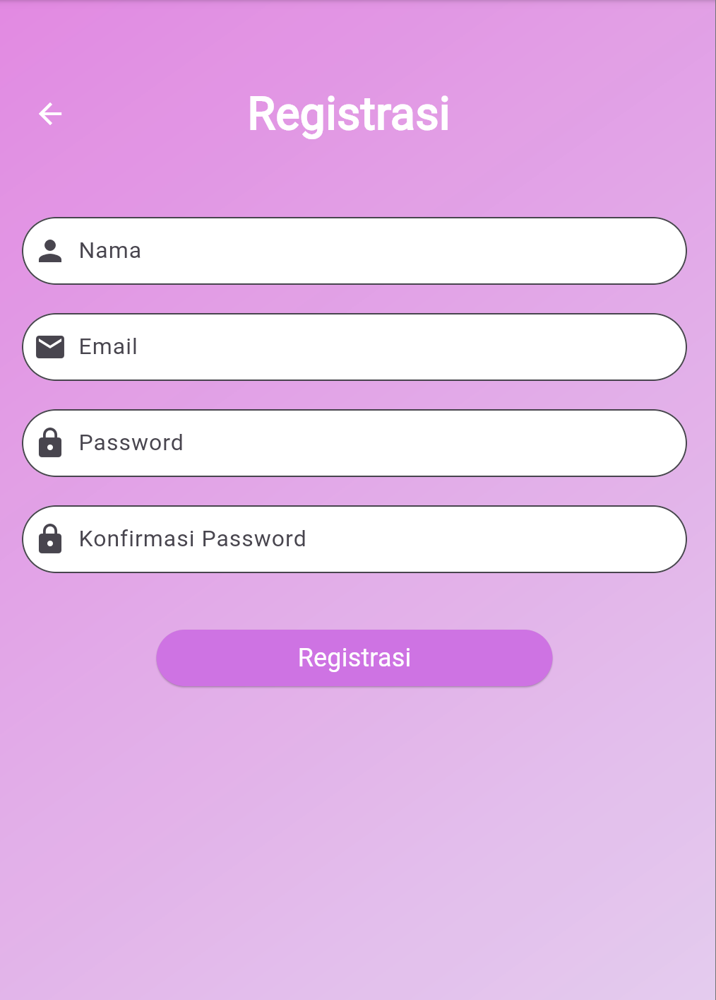
- Pengguna mengisi form registrasi dengan nama, email, dan password. Tiga TextEditingController digunakan untuk mengelola input pengguna: _namaTextboxController untuk nama, _emailTextboxController untuk email, _passwordTextboxController untuk password.
- Setiap input memiliki validator untuk memastikan data yang dimasukkan sesuai dengan kriteria:
Nama: Minimal 3 karakter.
Email: Harus diisi dan valid.
Password: Minimal 6 karakter.
Konfirmasi Password: Harus sama dengan password yang dimasukkan.
- Ketika tombol "Registrasi" ditekan, fungsi _submit() dipanggil setelah validasi form berhasil. Jika validasi berhasil dan tombol tidak dalam status loading, proses registrasi dimulai.
- Memanggil RegistrasiBloc.registrasi(...): Mengirim data registrasi ke backend.
Jika registrasi berhasil, dialog sukses akan ditampilkan dengan widget SuccessDialog.
Jika registrasi gagal, dialog peringatan akan ditampilkan dengan widget WarningDialog.
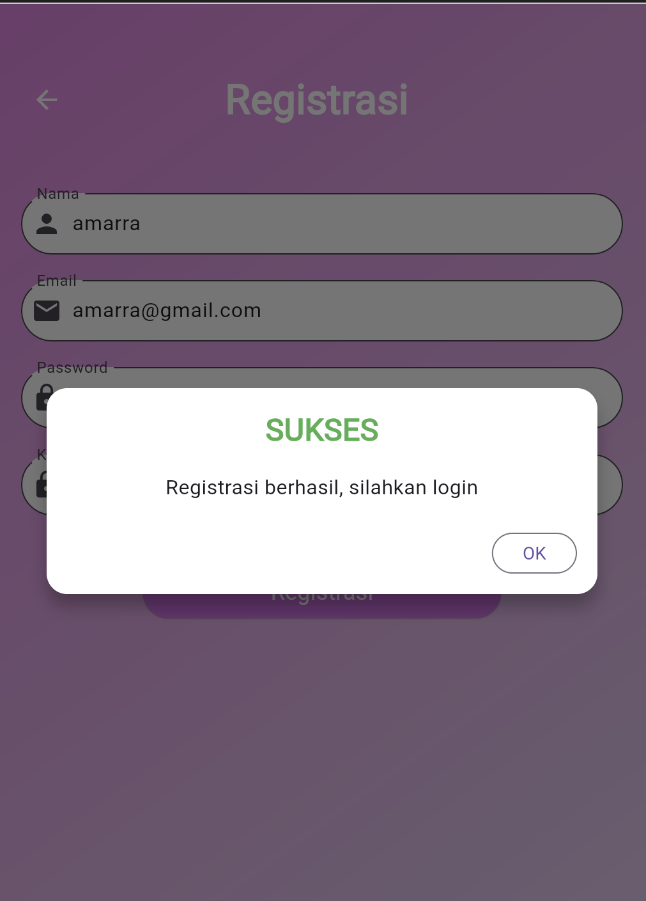

*Proses Login*
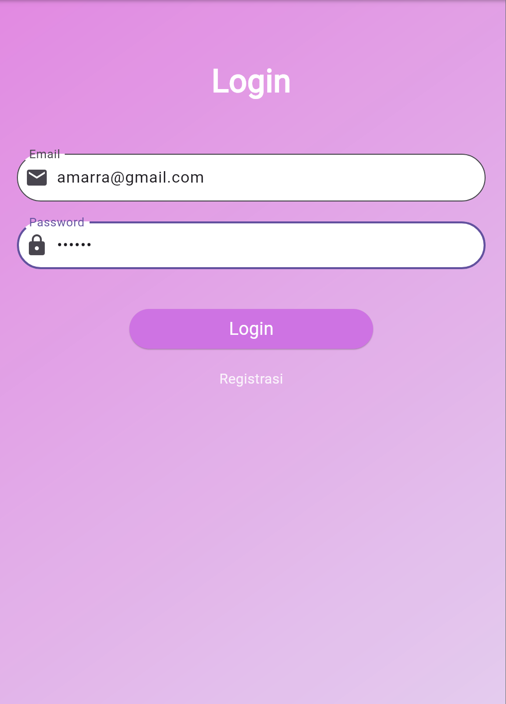
- Pengguna memasukkan email dan password di form yang disediakan. Input ini dikelola oleh TextEditingController, yaitu _emailTextboxController untuk email dan _passwordTextboxController untuk password.
- Setelah mengisi email dan password, pengguna menekan tombol "Login" (_buttonLogin). Tombol ini akan memanggil metode _submit() ketika ditekan dan form divalidasi. Dalam _submit(), terdapat pengecekan untuk memastikan bahwa form telah divalidasi (_formKey.currentState!.validate()) dan bahwa proses loading (_isLoading) tidak sedang berlangsung. 
- Setelah validasi, fungsi LoginBloc.login() dipanggil dengan parameter email dan password yang diinput oleh pengguna.
Fungsi ini mengembalikan Future, dan kita menggunakan .then() untuk menangani respons yang diterima.
- Jika login berhasil (dalam contoh ini, jika value.code sama dengan 200), kita menyimpan token dan ID pengguna menggunakan kelas UserInfo. Setelah menyimpan informasi, dialog sukses ditampilkan menggunakan SuccessDialog, yang memberi tahu pengguna bahwa login berhasil. Jika pengguna menekan tombol "OK" di dialog sukses, mereka akan diarahkan ke halaman produk (ProdukPage).
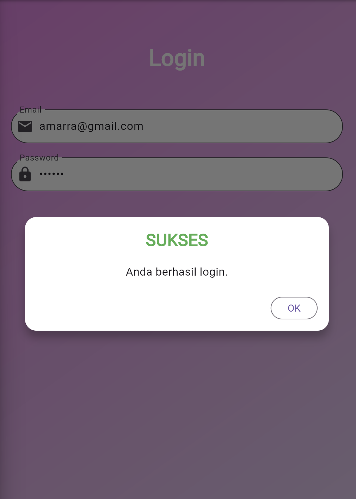
- Jika respons dari server tidak berhasil (misalnya, jika kode bukan 200), atau jika terjadi kesalahan selama proses login (ditangani oleh .catchError()), dialog peringatan ditampilkan menggunakan _showWarningDialog(), yang memberi tahu pengguna bahwa login gagal.

*Proses Ubah Data*
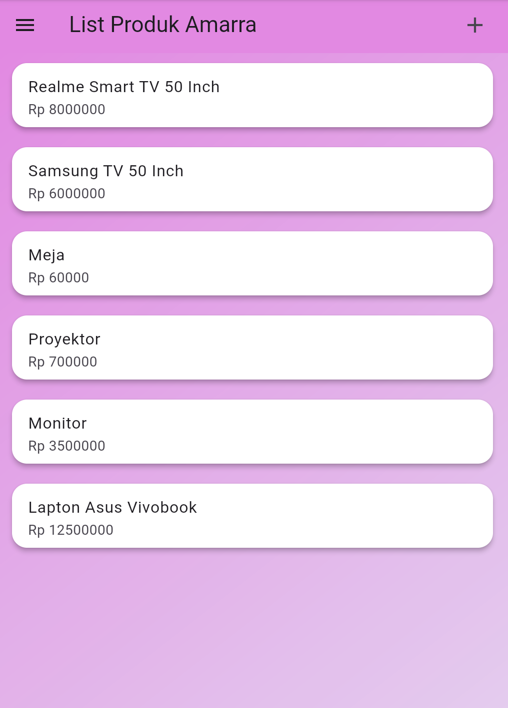
- Pada halaman produk page, pengguna dapat melihat list produk apa saja yang tersedia. Ketika pengguna mengklik salah satu produk, maka akan masuk ke halaman detail produk.
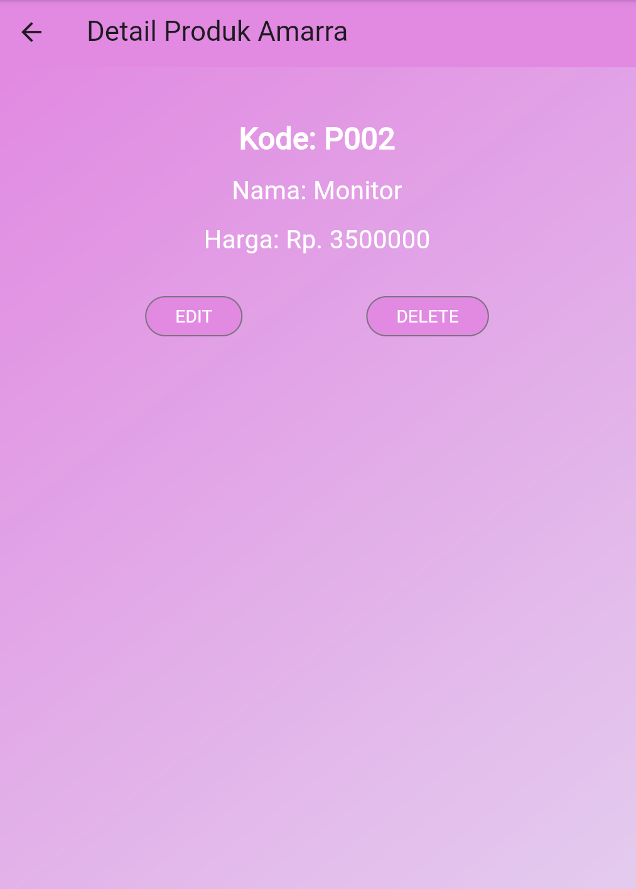
- Ketika pengguna mengklik tombol "EDIT", aplikasi akan mengarahkan pengguna ke halaman ProdukForm dengan mengirimkan objek produk yang dipilih.
- Di halaman ProdukForm, pengguna dapat mengedit data produk, seperti nama, harga, dan informasi lainnya.
-  Setelah pengguna menyelesaikan pengeditan dan menekan tombol untuk menyimpan, produk akan diperbarui di database melalui ProdukBloc. Proses penyimpanan ini harus memastikan bahwa data yang dimasukkan valid dan mengupdate state aplikasi jika diperlukan.
Bisa dilihat bahwa harga monitor ketika berhasil diedit, maka data yang ditampilkan di produk page akan terupdate.
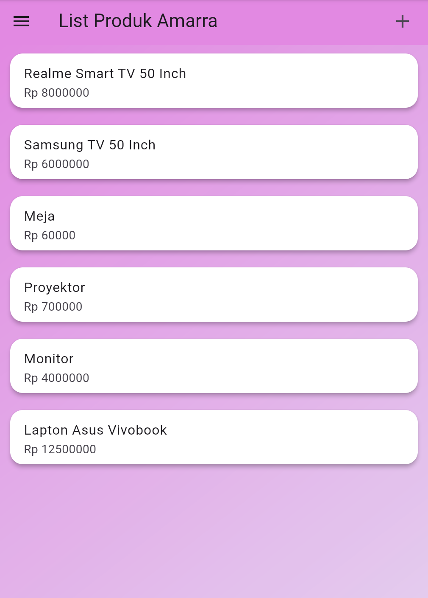

*Proses Hapus Data*
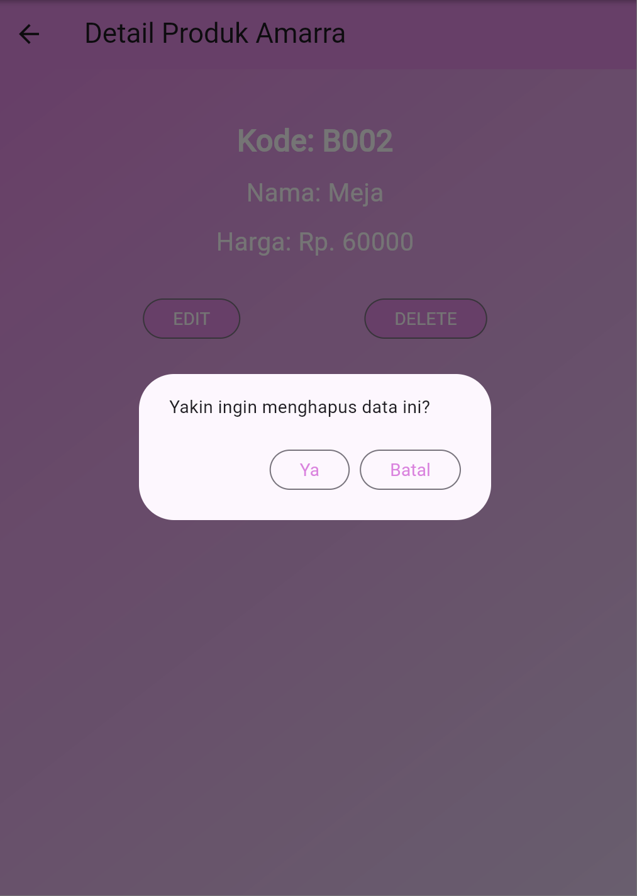
- Ketika pengguna mengklik tombol "DELETE", fungsi confirmHapus() akan dipanggil. Ini akan menampilkan dialog konfirmasi yang menanyakan kepada pengguna apakah mereka yakin ingin menghapus data.
- Jika pengguna mengonfirmasi dengan menekan tombol "Ya", sistem akan memanggil metode deleteProduk pada ProdukBloc, menggunakan ID produk yang ingin dihapus.
- Jika penghapusan berhasil, aplikasi akan kembali ke halaman ProdukPage untuk memperbarui daftar produk. Jika gagal, akan muncul dialog peringatan yang memberi tahu pengguna bahwa penghapusan gagal.
Bisa dilihat pada halaman produk page bahwa data produk meja tidak ada atau berhasil terhapus.
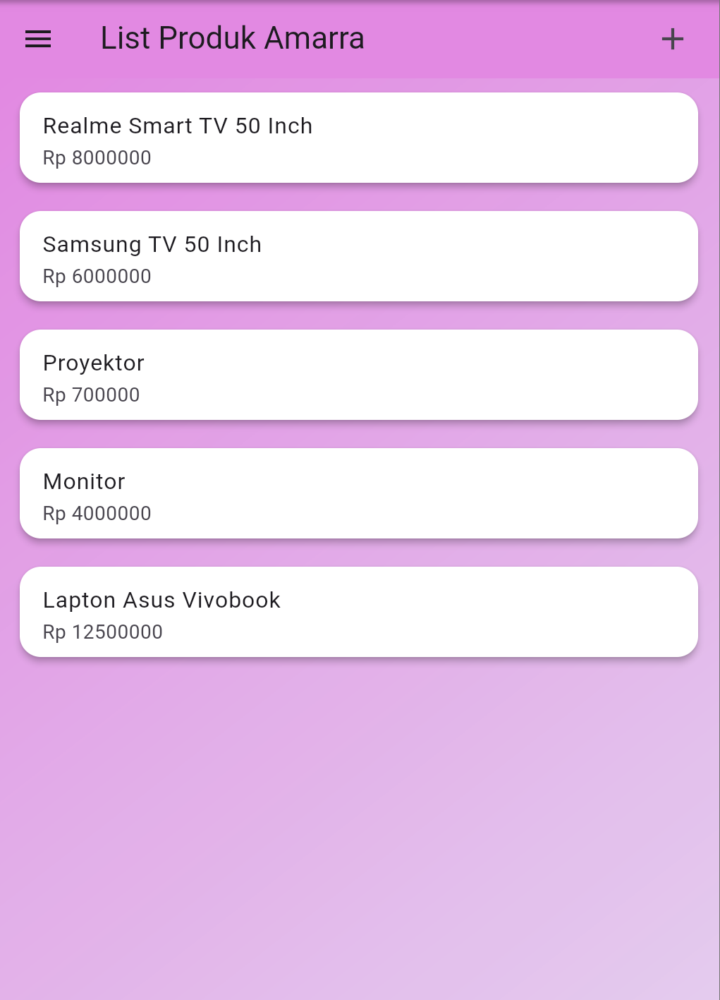

*Proses Tambah Data*
- Pada halaman produk page, ketika pengguna memencet simbol +, maka akan menangani navigasi ke halaman ProdukForm. Halaman ini berisi beberapa input field untuk mengumpulkan informasi produk baru, seperti nama produk, harga, dan kode produk. Biasanya menggunakan widget seperti TextField untuk input teks.
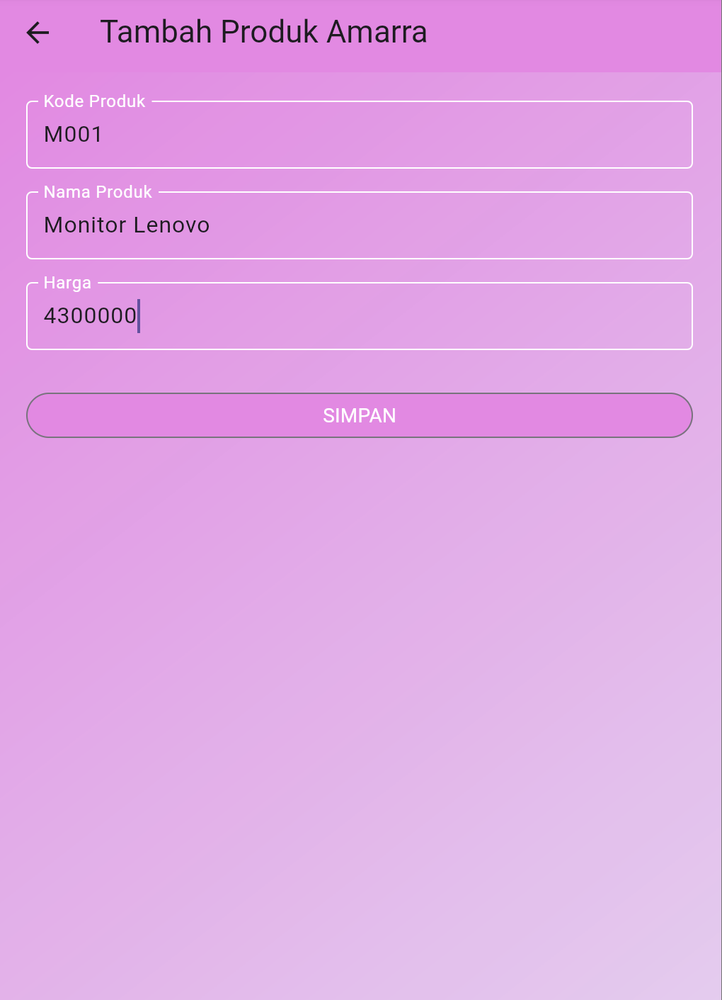
- Pengguna mengisi form di ProdukForm dan menekan tombol "SIMPAN".
- Ketika pengguna menekan tombol "SIMPAN", fungsi _tambahProduk() akan dipanggil untuk menangani penambahan produk baru. 
- Jika validasi berhasil, objek produk baru dibuat. Dan, metode dari ProdukBloc dipanggil untuk menyimpan produk baru ke database.
- Setelah penyimpanan berhasil, pengguna kembali ke ProdukPage.
- Pada saat halaman ProdukPage dimuat, maka akan mengambil data produk dari database dan menampilkannya dalam bentuk daftar.
Bisa dilihat bahwa data produk "Monitor Lenovo" berhasil ditampilkan di halaman ProdukPage.
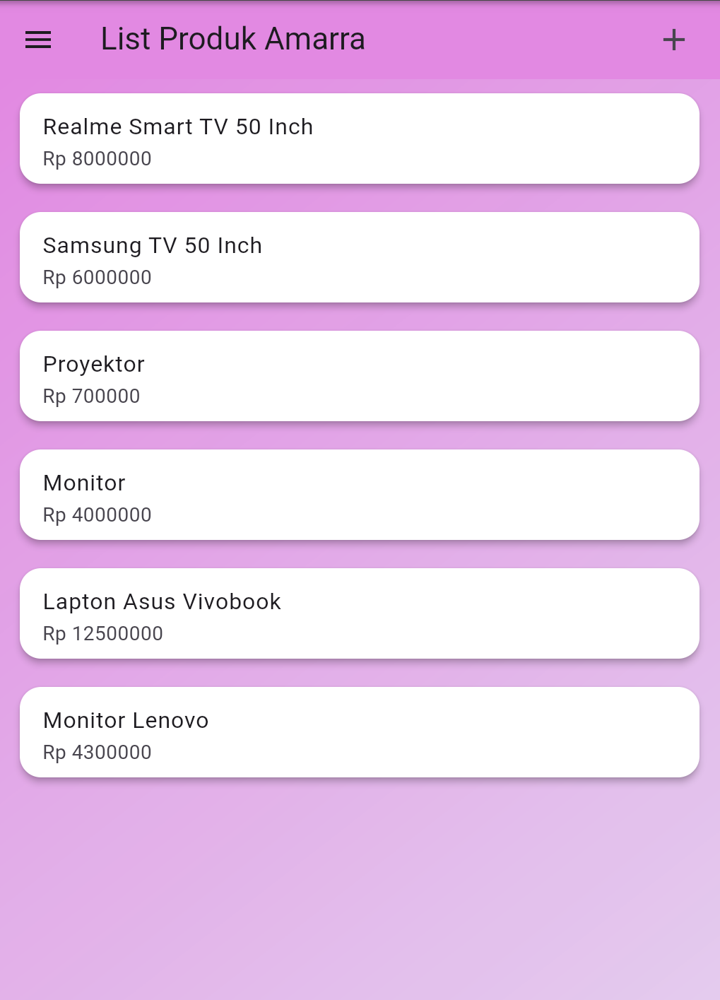

*Proses Logout*
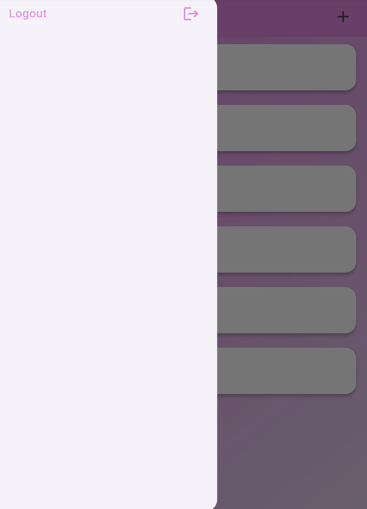
- Pada halaman ProdukPage, terdapat drawer (menu samping) yang menyajikan pilihan Logout.
- Ketika pengguna menekan opsi Logout, fungsi LogoutBloc.logout() dipanggil. Fungsi ini biasanya akan menangani proses penghapusan sesi pengguna, misalnya dengan menghapus token otentikasi dari penyimpanan lokal (SharedPreferences).\
- Setelah logout berhasil, aplikasi akan menavigasi pengguna kembali ke halaman LoginPage. Di sini, Navigator.of(context).pushAndRemoveUntil digunakan untuk menghapus semua rute sebelumnya dari stack, sehingga pengguna tidak dapat kembali ke halaman yang memerlukan otentikasi setelah logout.
